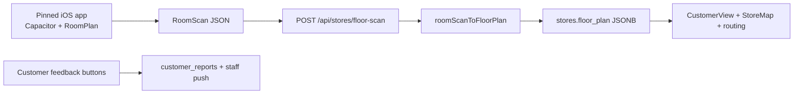

# LiDAR Feasibility Assessment

## Executive summary

True LiDAR floor scanning (Apple RoomPlan / ARKit) **cannot run inside the browser**. Pinned ships a **Capacitor iOS app** that captures room geometry and uploads it to the web backend. The web app **consumes scanned maps** for customer wayfinding, routing, and product pins.

**Status:** Capacitor shell + RoomPlan plugin scaffolded in-repo. Web scan pipeline, customer feedback loop, and scanned-plan rendering are implemented. App Store submission requires Apple Developer + physical LiDAR device QA on Mac/Xcode.

## Accuracy tiers (honest product model)

| Tier | What you get | How |
|---|---|---|
| **Zone / aisle (v1)** | “Dairy, ~Aisle 4” | LiDAR scan → admin labels zones → AI keyword auto-place |
| **Aisle + side** | “Left side of Aisle 4” | Admin splits zones after scan (roadmap) |
| **Shelf-exact** | Pin on exact facing | Guided barcode-at-shelf walk in native app (roadmap) |

LiDAR gives **geometry**, not product labels. Admin workflow + customer feedback (“Not here”, “Out of stock”) keep locations trustworthy over time.

## What LiDAR gives us

- Accurate store outline and fixture positions
- Obstacle-aware wayfinding without manual template editing
- Premium “scan your store in 60 seconds” onboarding story
- Entrance anchor for 2D routing (no GPS indoors)

## Platform reality

| Platform | Capability | Notes |
|---|---|---|
| **Web / PWA** | No RoomPlan | Browsers cannot access ARKit RoomPlan or device LiDAR APIs |
| **iOS (Capacitor)** | ARKit RoomPlan | Requires LiDAR iPhone/iPad; see [NATIVE_IOS.md](./NATIVE_IOS.md) |
| **Android** | ARCore | No direct RoomPlan equivalent; future follow-on |

## Architecture (implemented)

## Customer trust loop (shipped on web)

When a pin is wrong, customers tap:

- **Not here** → `missing` report → staff queue
- **Out of stock** → marks product OOS + report
- **Report a problem** → optional note → staff notification

Staff see reports at `/staff?storeId=…` (PIN) and owners on the dashboard. Web push fires when VAPID keys are configured.

## What is wired in code

| Piece | Location | Status |
|---|---|---|
| Scan data model | `lib/scan/types.ts` | Done |
| Native bridge contract | `lib/scan/capability.ts`, `lib/native/installScanBridge.ts` | Done |
| RoomScan → FloorPlan | `lib/scan/convert.ts` | Done |
| Scanned plan rendering | `lib/floorPlans/resolve.ts`, `StoreMap`, `CustomerView` | Done |
| Upload endpoint | `app/api/stores/floor-scan/route.ts` | Done |
| Onboarding scan wire-up | `ScanStorePanel`, step-2, draft persist | Done |
| Customer reports | `006_customer_reports.sql`, `/api/reports`, UI buttons | Done |
| Persistence columns | `005_floor_scan.sql`, `006_customer_reports.sql` | Run in Supabase |
| Capacitor iOS + RoomPlan plugin | `ios/App/App/PinnedScanPlugin.swift` | Scaffolded — QA on device |
| Native build guide | `docs/NATIVE_IOS.md` | Done |

## Interim web accuracy (without LiDAR)

- Structured templates with labeled zones
- Snap-to-zone tagging
- AI auto-placement (`/api/products/auto-place`)
- Animated wayfinding from entrance to pin

## Recommendation

1. **Run migrations 005 + 006** in Supabase.
2. **Deploy web** — feedback buttons and scanned-plan rendering work immediately.
3. **Build iOS on Mac** — `npm run cap:sync`, open Xcode, test scan on LiDAR hardware.
4. **Submit to App Store** — expect 1–3 day review; native RoomPlan justifies the shell vs pure web wrapper.
5. **Next roadmap:** post-scan aisle labeling UI, barcode guided tagging, optional customer AR arrows.

## References

- [Apple RoomPlan](https://developer.apple.com/augmented-reality/roomplan/)
- [NATIVE_IOS.md](./NATIVE_IOS.md) — build + App Store checklist
- Pinned floor plan types: `lib/floorPlans/types.ts`
