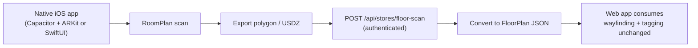

# LiDAR Feasibility Assessment

## Executive summary

True LiDAR floor scanning (Apple RoomPlan / ARKit) **cannot run inside the current Pinned web app or PWA**. It requires a **native iOS companion** that exports room geometry, which Pinned then converts into our structured `FloorPlan` format. This is a **medium–large follow-on project**, best pursued after the web product validates demand.

## What LiDAR would give us

- Accurate store outline and fixture positions
- Obstacle-aware wayfinding without manual template editing
- Premium “scan your store in 60 seconds” onboarding story

## Platform reality

| Platform | Capability | Notes |
|----------|------------|-------|
| **Web / PWA** | No RoomPlan | Browsers cannot access ARKit RoomPlan or device LiDAR APIs |
| **iOS (native)** | ARKit RoomPlan | Requires iPhone/iPad Pro with LiDAR; Apple Developer account |
| **Android** | ARCore | No direct RoomPlan equivalent; mesh quality varies by device |

RoomPlan produces room polygons and optional USDZ exports. That data must be **converted server-side** (or on-device) into Pinned’s `FloorPlan` schema (`lib/floorPlans/types.ts`).

## Recommended architecture

1. **Thin native shell** — Capacitor plugin wrapping ARKit RoomPlan, or a standalone SwiftUI utility app.
2. **Export format** — Room boundary polygon + optional zone labels (manual or AI-assisted).
3. **Upload endpoint** — Authenticated API stores raw scan + derived `FloorPlan`.
4. **Web app** — No change to customer wayfinding or tagging UX; only the map source differs.

## Effort and risk

| Area | Estimate | Risk |
|------|----------|------|
| Native iOS RoomPlan integration | 2–4 weeks | Medium — device testing, App Store review |
| Polygon → FloorPlan converter | 1–2 weeks | Medium — irregular store layouts |
| Upload + persistence API | 3–5 days | Low |
| QA on real stores | Ongoing | High — lighting, clutter, open aisles |

**Dependencies:** Apple Developer Program, physical LiDAR hardware for QA, native build pipeline separate from Vercel.

## What we ship now (interim web accuracy)

Without LiDAR, Pinned improves placement accuracy via:

- **Structured templates** with labeled zones (`lib/floorPlans/templates.ts`)
- **Snap-to-zone** when placing pins on templates
- **Pinch/scroll zoom + pan** for precise tap placement
- **AI auto-placement** mapping products to zones (`/api/products/auto-place`)
- **Animated wayfinding** from entrance to pin on template stores

These deliver most of the customer-facing “wow” without native hardware.

## Recommendation

1. **Ship and sell the web product** with structured templates, wayfinding, and auto-placement.
2. **Validate with paying stores** — ask whether photo/template setup is the main blocker.
3. **If scan demand is strong**, build the iOS companion as a fast-follow (Capacitor + ARKit plugin is the lowest-friction path for a team already on Next.js).
4. **Do not block web launch** on LiDAR; treat it as a premium tier or upsell later.

## References

- [Apple RoomPlan](https://developer.apple.com/augmented-reality/roomplan/)
- Pinned structured floor plan types: `lib/floorPlans/types.ts`
- Interim placement UX: `components/onboarding/SpeedTagger.tsx`
